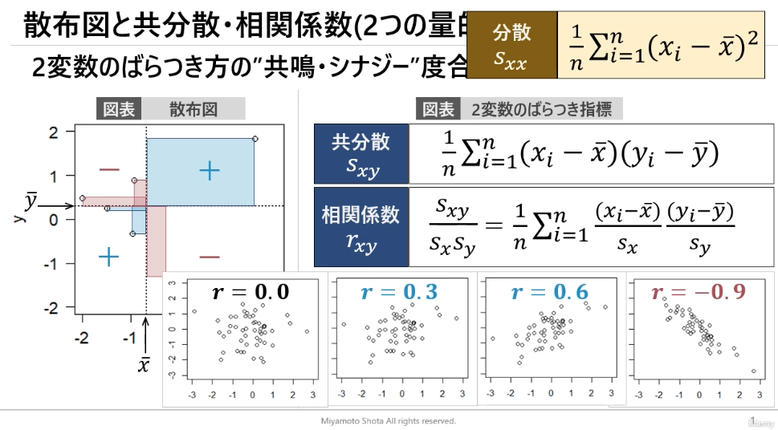

# §2 記述統計

## 変数の分類

* 質的変数 (=ラベル)
  * 名義尺度: 同じ値かどうか
  * 順序尺度: 値の大小関係に意味がある (例：ランキング)
* 量的変数
  * 間隔尺度: 値の差の大きさに意味がある
    * 例：気温
  * 比例尺度: 値の比に意味がある (=0に絶対的意味)
    * 例：長さ、重さ、価格

## ヒストグラム・累積分布

* 量的変数の分布を図で把握
* ヒスグラム
  * 変数の階級に対する度数または相対度数 (=度数の分布を表現)
* 累積分布
  * 変数の階級に対する累積相対度数

## 中心・散らばりの指標

* 量的変数 $x$ を具体的な指標で評価
* 平均 $\bar{x}$ : 中心の指標

  $$ \bar{x} = \frac{1}{n} \Sigma_{i=1}^n x_i $$

  * 分布が偏ると外れ値を影響を受けやすい
  * -> 中央値、四分位範囲で解釈

* 分散 $s^2$ ・標準偏差 $s$ : 散らばりの指標
  * 標本分散では分母は $n$ 、不偏分散では $n-1$

  $$ s^2 = \frac{1}{n} \Sigma_{i=1}^n (x_i - \bar{x})^2 $$

  $$ s = \sqrt{s^2} $$

* 変数の標準化 $z$

  $$ z = \frac{x_i - \bar{x}}{s} $$

* 変動係数 $cv$: 異なる変数間のばらつきを評価できる

  $$ cv = \frac{s}{\bar{x}} $$
  
## 順序統計量・箱ひげ図

* 順序統計量
  * 最小値
  * 第1四分位値：小さい方から25%の区切り値
  * 中央値：小さい方から50%の区切り値
  * 第3四分位値：小さい方から75%の区切り値
  * 最大値
* 四分位範囲
  * 第1四分位値〜第3四分位値の範囲
* 箱ひげ図
  * 順序統計量・四分位範囲を可視化
  * ひげの範囲
    * 上側 =「第3四分位数 + 1.5x四分位範囲」に含まれる最大の観測値
    * 下側 =「第1四分位数 - 1.5x四分位範囲」 に含まれる最小の観測値
    * ひげの上側 = 「第3四分位数 + 1.5x四分位範囲」
      ひげの下側 = 「第1四分位数 - 1.5x四分位範囲」
      には、必ずしもならないことに注意
    * ひげより外側のデータは **外れ値** として扱う

## 散布図・共分散・相関係数

* 2変数のばらつき方の「共鳴度合い」を図示・指標化
* 散布図上の矩形の面積 = 共分散 $s_{xy}$

  $$ s_{xy} = \frac{1}{n} \Sigma_{i=1}^n (x_i - \bar{x}) (y_i - \bar{y}) $$

* 相関係数： $s_{xy}$ の $x, y$ の単位(スケール)の影響を除いたもの

  $$ \frac{s_{xy}}{s_{x} s_{y}} = \frac{1}{n} \Sigma_{i=1}^n \frac{(x_i - \bar{x})}{s_x} \frac{(y_i - \bar{y})}{s_y} $$

  * 相関係数は必ず $[-1.0, +1.0]$ の範囲となる
  * 2変数の相関性が高いほど相関係数は $-1.0, +1.0$ に近づく

## 偏相関係数

* 相関係数の注意点
  * 因果関係とは直接関係ない
  * 非線形の関係は考慮できない
  * 擬相関（見かけ上の相関）の恐れ → 偏相関係数を用いる

* 偏相関係数
  * 2変数のばらつきの指標（第3の変数の影響を除く）

  $$ r_{(xy \cdot z)} = \frac{r_{xy} - r_{xz} r_{zy}}{\sqrt{1 - r_{xy}^2}{\sqrt{1- r_{zy}^2}}} $$

  

