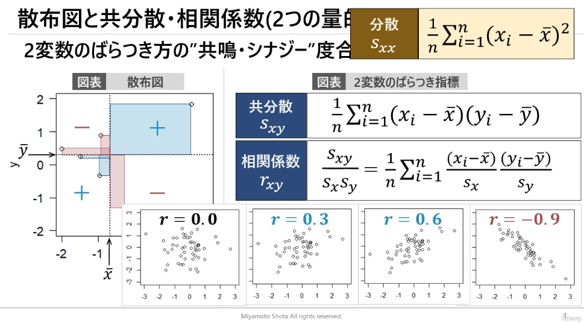

# §2 記述統計

## 変数の分類

* 質的変数 (=ラベル)
  * 名義尺度: 同じ値かどうか
  * 順序尺度: 値の大小関係に意味がある (例：ランキング)
* 量的変数
  * 間隔尺度: 値の差の大きさに意味がある
    * 例：気温
  * 比例尺度: 値の比に意味がある (=0に絶対的意味)
    * 例：長さ、重さ、価格

## ヒストグラム・累積分布

* 量的変数の分布を図で把握
* ヒスグラム
  * 変数の階級に対する度数または相対度数 (=度数の分布を表現)
* 累積分布
  * 変数の階級に対する累積相対度数

## 中心・散らばりの指標

* 量的変数 $x$ を具体的な指標で評価
* 平均 $\bar{x}$ : 中心の指標

  $$ \bar{x} = \frac{1}{n} \Sigma_{i=1}^n x_i $$

  * 分布が偏ると外れ値を影響を受けやすい
  * -> 中央値、四分位範囲で解釈

* 分散 $s^2$ ・標準偏差 $s$ : 散らばりの指標
  * 標本分散では分母は $n$ 、不偏分散では $n-1$

  $$ s^2 = \frac{1}{n} \Sigma_{i=1}^n (x_i - \bar{x})^2 $$

  $$ s = \sqrt{s^2} $$

* 変数の標準化 $z$

  $$ z = \frac{x_i - \bar{x}}{s} $$

* 変動係数 $cv$: 異なる変数間のばらつきを評価できる

  $$ cv = \frac{s}{\bar{x}} $$
  
## 順序統計量・箱ひげ図

* 順序統計量
  * 最小値
  * 第1四分位値：小さい方から25%の区切り値
  * 中央値：小さい方から50%の区切り値
  * 第3四分位値：小さい方から75%の区切り値
  * 最大値
* 四分位範囲
  * 第1四分位値〜第3四分位値の範囲
* 箱ひげ図
  * 順序統計量・四分位範囲を可視化
  * ひげの範囲
    * 上側 =「第3四分位数 + 1.5x四分位範囲」に含まれる最大の観測値
    * 下側 =「第1四分位数 - 1.5x四分位範囲」 に含まれる最小の観測値
    * ひげの上側 = 「第3四分位数 + 1.5x四分位範囲」
      ひげの下側 = 「第1四分位数 - 1.5x四分位範囲」
      には、必ずしもならないことに注意
    * ひげより外側のデータは **外れ値** として扱う

## 散布図・共分散・相関係数

* 2変数のばらつき方の「共鳴度合い」を図示・指標化
* 散布図上の矩形の面積 = 共分散 $s_{xy}$

  $$ s_{xy} = \frac{1}{n} \Sigma_{i=1}^n (x_i - \bar{x}) (y_i - \bar{y}) $$

* 相関係数 $r_{xy}$ ： $s_{xy}$ の $x, y$ の単位(スケール)の影響を除いたもの

  $$ r_{xy} = \frac{s_{xy}}{s_{x} s_{y}} = \frac{1}{n} \Sigma_{i=1}^n \frac{(x_i - \bar{x})}{s_x} \frac{(y_i - \bar{y})}{s_y} $$

  * 相関係数は必ず $[-1.0, +1.0]$ の範囲となる
  * 2変数の相関性が高いほど相関係数は $-1.0, +1.0$ に近づく

## 偏相関係数

* 相関係数の注意点
  * 因果関係とは直接関係ない
  * 非線形の関係は考慮できない
  * 擬相関（見かけ上の相関）の恐れ → 偏相関係数を用いる

* 偏相関係数
  * 2変数のばらつきの指標（第3の変数の影響を除く）

  $$ r_{(xy \cdot z)} = \frac{r_{xy} - r_{xz} r_{zy}}{\sqrt{1 - r_{xy}^2}{\sqrt{1- r_{zy}^2}}} $$

## 回帰直線

$ \hat{y} = \hat{\alpha} + \hat{\beta} x_i $ という線形式で2つの量的変数の関係を記述。（ $\hat{}$ は推定値）

| 項目 | 式 |
| --- | --- |
| 残差 $ e_i $ | $ y_i - \hat{y}_i = y_i - ( \hat{\alpha} + \hat{\beta} x_i ) $ |
| 残差平方和 $ S(\hat{\alpha}, \hat{\beta}) $ | $ \Sigma_{i=1}^n e_i^2 = \Sigma_{i=1}^n ( y_i - \hat{y}_i )^2 $ |

この残差平方和の最小二乗法により $\hat{\alpha}, \hat{\beta}$ を推定

| 項目 | 式 |
| --- | --- |
| 回帰係数 $\hat{\beta}$ | $$\frac{s_{xy}}{s_{xx}} = r_{xy} \frac{s_y}{s_x}$$ （ $r_{xy}$ は相関係数 ）|
| 定数項 $\hat{\alpha}$ | $\bar{y} - \hat{\beta} \bar{x}$ （ $\bar{}$ は平均 ） |

回帰直線は $( \bar{x}, \bar{y} )$ （＝ $x, y$ の重心）を必ず通るという性質を持つ

## 決定係数

回帰直線の「あてはまりのよさ」を測る指標

| 項目 | 式 |
| --- | --- |
| 決定係数 | $$R^2 = \frac{S_R}{S_y}$$  ※ただし、$S_y = S_R + S_e$ |

* 各係数の式
    * $S_y = \sum_i^n (y_i - \bar{y})^2$
    * $S_e = \sum_i^n (y_i - \hat{y_i})^2$
    * $S_R = \sum_i^n (\hat{y_i} - \bar{y})^2$

* 回帰直線がうまくあてはまる
    * $S_e$ が小さくなり $S_R$ が大きくなる
    * => 決定係数 $R^2$ が大きくなる
* 回帰直線があてはまらない
    * $S_e$ が大きくなり $S_R$ が小さくなる
        * 図で言うと傾きが浅くなるため $\hat{y_i}$ が $\bar{y}$ に近づき、 $S_R$ が小さくなる
        * 相関性がない場合は、直線は傾かない（「相関係数」の節を参照）
    * => 決定係数 $R^2$ が小さくなる

## 時系列データの記述
時系列：「時間」という特別は変数に関するデータの記述

| 項目 | 式 |
| --- | --- |
| 差 | $y_{t+1} - y_t$ |
| 変化率 | $(y_{t+1} - y_t) / y_t$ |
| 幾何平均 $r_G$ （$T$ 期間） | $$y_T = y_0 \times r_G^T$$ すなわち $$r_G = (y_T / y_0)^{1/T}$$ |
| 指数化 $q_t$ （$S$時点基準） | $$q_t = y_t / y_s$$ （参考：ラスパイレス指数など） |

**ラスパイレス指数**

* $L = \sum_i p_{ti} q_{ti} / \sum_i p_{0i} q_{0i}$
* ウェイト $w_i = p_{0i} / q_{01}$ を導入すると $ L = \sum_i w_i (p_{ti} / p_{0i}) / \sum_i w_i$
* 物価指数を求める際などで使われるらしい

## 時系列データの変動分析と自己相関
時系列データの分析は「時間」の及ぼす変動がポイント

$$y_t = TC_t + S_t + I_t$$

| 項目 | 内容 |
| --- | --- |
| $y_t$ | 元の時系列データ |
| $TC_t$ | TC=trend cycle 傾向変動（trend）および循環変動（cycle）。傾向変動：長期に渡る基本的な持続的変動。循環変動：ある一定の周期で現れる変換 |
| $S_t$ | S=seasonal 季節変動：1年を周期として循環を繰り返す変動
| $I_T$ | I=iregular 不規則変動：それ以外の規則的ではない変動。偶然変動

* 自己共分散関数 $C_h$ （$h$ ：タイムラグ）
  $$ C_h = \frac{1}{T} \sum_{t=1}^{T-h} (y_t - \bar{y}) (y_{t+h} - \bar{y}) $$
* 自己相関係数 $r_h = C_h / C_0$
* コレログラム：自己相関係数を可視化

## クロス集計表とオッズ比
クロス集計表とオッズ比で[行]と[列]の関係を伺うことができる

**クロス集計表**

| (人) | 病気あり | 病気なし | 計 |
| --- | --- | --- | --- |
| 習慣あり | 30 | 20 | 50 |
| 習慣なし | 10 | 40 | 50 |
| 計 | 40 | 60 | 100 |

**行パーセント表**

| (人) | 病気あり | 病気なし | 計 |
| --- | --- | --- | --- |
| 習慣あり | A：60% | B：40% | 100% |
| 習慣なし | C：20% | D：80% | 100% |

* -> 習慣の有無が変わらないのであれば、A,BやC,Dの比は変わらないはず
* -> 逆を言えば、習慣の有無が影響するなら、A,BやC,Dの比は大きくなる

**オッズ**

「習慣」によって「病気」となるオッズ

* 「習慣あり」 $A/B$
* 「習慣なし」 $C/D$

**オッズ比**

$(A/B)/(C/D)$

* 「習慣あり」によって「病気」になることが、「習慣なし」の場合と比べて●倍
* オッズ比 $= (0.6/0.4)/(0.2/0.8) = 6$

