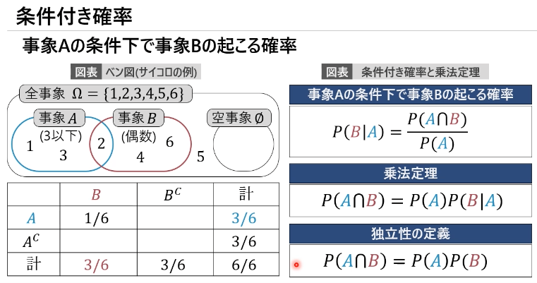
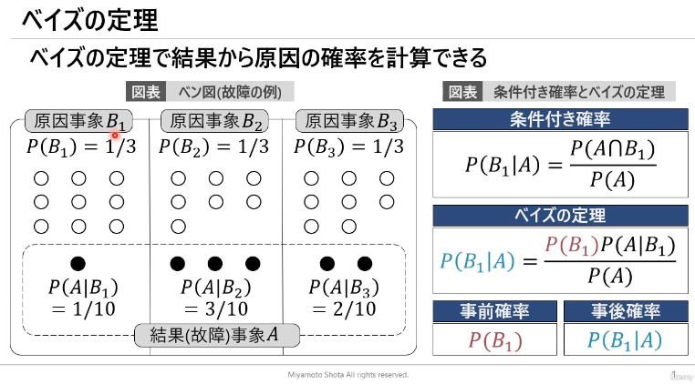

# §3 確率統計

## 事象と確率

### 試行と事象
| 項目 | 内容 |
| --- | --- |
| 試行 | 結果が偶然によって左右される実験や観測 |
| 事象 | 試行によって起こる個々の結果の集合。 $A,B$ などで表記 |
| 全事象 | すべての根元事象の集合。標本空間。 $\Omega$ で表記 |

### 確率の定義
* $0 \le P(A) \le 1$
* $P(\Omega) = 1$
* $A,B$ が互いに排反な事象のとき $P(A \cup B) = P(A) + P(B)$

### 加法定理
$A,B$ が互いに排反な事象でないとき、

$$P(A \cup B) = P(A) + P(B) - P (A \cap B)$$

> $P (A \cap B)$ は $A$ と $B$ の積事象

## 条件付き確率
事象 $A$ の条件下で事象 $B$ が起こる確率

$$P(B \mid A) = \frac{P(A \cap B)}{P(A)}$$

### 乗法定理

$$P(A \cap B) = P(A) P(B \mid A)$$

### 独立性の定義
$A$ と $B$ がそれぞれ独立なとき

$$P(A \cap B) = P(A) P(B)$$

> 事象 $A$ が起きる世界の中での 事象 $B$ が起きる確率と
> 全事象の中で事象 $B$ が起きる確率が等しければ、$A$ と $B$ は独立。
> そうでなければ、独立ではない。

以下の図の例で例えると

* $P(A) = 3/6$
* $P(B \mid A) = 1/3$
* $P(B) = 3/6$

となり $P(B \mid A) \neq P(B)$ となり、$A$ と $B$ は独立ではない。

また、

$$P(B \mid A) = \frac{P(A \cap B)}{P(A)} = \frac{1/6}{3/6} = \frac{1}{3}$$

$$P(A \cap B) = P(A) P(B \mid A) = \frac{3}{6} \cdot \frac{1}{3} = \frac{1}{6}$$

となり、それぞれ図の通りになる

## ベイズの定理
ベイズの定理を用いると、結果から原因の確率を計算できる。

事象 $A$ の条件下で 事象 $B$ が起きる条件付き確率

$$P(B \mid A) = \frac{P(A \cap B)}{P(A)}$$

をさらに展開して

$$P(B \mid A) = \frac{P(B) P(A \mid B)}{P(A)}$$

とする。

この時 $P(B)$ を「事前確率」、$P(B | A)$ を「事後確率」と呼ぶ。

例えば、以下の図で

* 商品 $A$ が故障品である確率を $P(A)$ 
* 故障品の商品 $A$ が工場 $i$ で製造されている確率を $P(B_i | A)$

とすると、

例えば故障品が工場 $B_1$ で製造されている確率は

$$P(B_1 \mid A) = \frac{P(B_1) P(A \mid B_1)}{P(A)} $$
$$= \frac{10/30 \cdot 1/10}{6/30} = \frac{1}{6}$$

