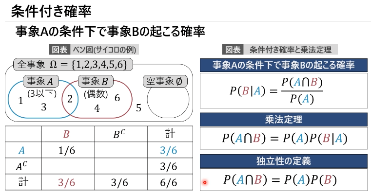
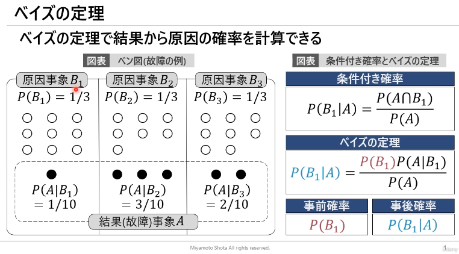
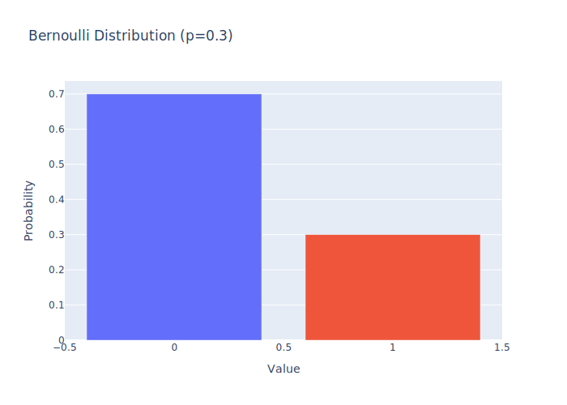
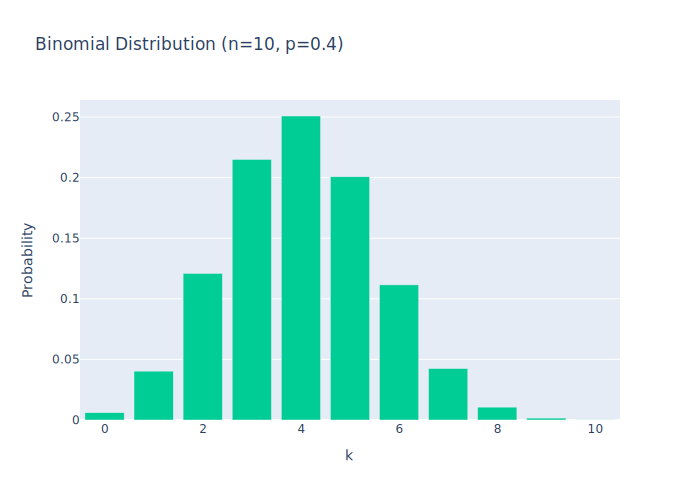
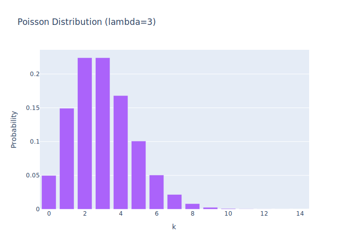
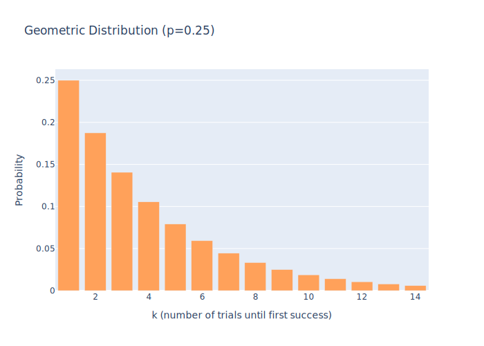

# §3 確率統計

## 20. 事象と確率

### 試行と事象

| 項目   | 内容                                                  |
| ------ | ----------------------------------------------------- |
| 試行   | 結果が偶然によって左右される実験や観測                |
| 事象   | 試行によって起こる個々の結果の集合。 $A,B$ などで表記 |
| 全事象 | すべての根元事象の集合。標本空間。 $\Omega$ で表記    |

### 確率の定義

* $0 \le P(A) \le 1$
* $P(\Omega) = 1$
* $A,B$ が互いに排反な事象のとき $P(A \cup B) = P(A) + P(B)$

### 加法定理

$A,B$ が互いに排反な事象でないとき、

```math
P(A \cup B) = P(A) + P(B) - P (A \cap B)
```

> [!NOTE]
> $P (A \cap B)$ は $A$ と $B$ の積事象


## 21. 条件付き確率

事象 $A$ の条件下で事象 $B$ が起こる確率

```math
P(B \mid A) = \frac{P(A \cap B)}{P(A)}
```

### 乗法定理

```math
P(A \cap B) = P(A) P(B \mid A)
```

### 独立性の定義

$A$ と $B$ がそれぞれ独立なとき

```math
P(A \cap B) = P(A) P(B)
```

> [!NOTE]
> 事象 $A$ が起きる世界の中での 事象 $B$ が起きる確率と、全事象の中で事象 $B$ が起きる確率が等しければ、 $A$ と $B$ は独立。
> そうでなければ、独立ではない。



上図の例では、

* $P(A) = 3/6$
* $P(B \mid A) = 1/3$
* $P(B) = 3/6$

すなわち $P(B \mid A) \neq P(B)$ となり、$A$ と $B$ は独立ではない。

また、

```math
P(B \mid A) = \frac{P(A \cap B)}{P(A)} = \frac{1/6}{3/6} = \frac{1}{3} \\

P(A \cap B) = P(A) P(B \mid A) = \frac{3}{6} \cdot \frac{1}{3} = \frac{1}{6}
```

となり、それぞれ図の通りになる


## 22. ベイズの定理

ベイズの定理を用いると、結果から原因の確率を計算できる。

事象 $A$ の条件下で 事象 $B$ が起きる条件付き確率

```math
P(B \mid A) = \frac{P(A \cap B)}{P(A)}
```

を、さらに展開して

```math
P(B \mid A) = \frac{P(B) P(A \mid B)}{P(A)}
```

とする。

この時 $P(B)$ を「事前確率」、$P(B | A)$ を「事後確率」と呼ぶ。



|       | $B_1$ | $B_2$ | $B_3$ | 計  |
| ----- | ----- | ----- | ----- | --- |
| $A$   | 1     | 3     | 2     | 6   |
| $A^c$ |       |       |       | 24  |
| 計    | 10    | 10    | 10    | 30  |

例えば、上図で

* 商品 $A$ が、故障品である確率を $P(A)$
* 工場 $i$ で製造される商品 $A$ が、故障品である確率を $P(A \mid B_i)$

とすると、例えば、商品 $A$ の故障品が、工場 $B_1$ で製造されている確率は

```math
\begin{align*}
P(B_1 \mid A) &= \frac{P(B_1) P(A \mid B_1)}{P(A)} \\
              &= \frac{10/30 \cdot 1/10}{6/30} \\
              &= \frac {1}{6}
\end{align*}
```

## 23-24. 確率変数と確率分布

確率関数 $f(x)$ や 累積分布関数 $F(x)$ を用いて、確率変数 $X$ の分布を表す。

* 確率関数 $f(x)$ : 確率変数 $X$ が値 $x$ をとる確率を与える関数。 すなわち $P(X=x)$ を与える関数
* 累積分布関数 $F(x)$ : 確率変数 $X$ が $x$ 以下の値をとる確率を与える関数

### 離散型確率分布

**確率変数**
ex. サイコロの目、コインの表裏

**確率関数** $f(x)$

```math
f(x_i) = P(X=x_i) \quad (i=1,2, \ldots)
```

```math
\begin{align*}
& 0 \le f(x_i) \le 1 \\
& \sum_{i} f(x_i) = 1
\end{align*}
```

**累積分布関数** $F(x)$

```math
F(x_i) = P(X \le x_i) = \sum_{x_j \le x_i} f(x_j)
```

例えば

```math
\begin{align*}
F(X=2) &= P(X=1) + P(X=2) & \\
       &= f(1) + f(2)
\end{align*}
```

### 連続型確率分布

**確率変数**
ex. 長さ、重さ、時間

**確率関数** $f(x)$

```math
f(x) \Delta x = P(x \le X \le x + \Delta x)
```

```math
\begin{align*}
& P(a \le X \le b) = \int_{a}^{b} f(x) dx \\
& \int_{-\infty}^{\infty} f(x) dx = 1
\end{align*}
```

累積分布関数

```math
F(x) = P(X \le x) = \int_{-\infty}^{x} f(t) dt
```

例えば

```math
\begin{align*}
F(X=170) &= P(X \le 170) \\
         &= \int_{-\infty}^{170} f(x) dx
\end{align*}
```

## 25. 期待値と分散

確率変数 $X$ の期待値 $E(X)$ と分散 $V(X)$ は以下のように定義される。

* 期待値とは、分布の中心。確率関数 $f(x)$ による加重平均
* 分散とは、母平均 $\mu$ からのばらつきの度合いであり、母平均 $\mu$ からの二乗距離の期待値 $E[(X-\mu)^2]$ で表される

> [!NOTE]
> 母平均と期待値との違い
> * 母平均 : 母集団全体の平均
> * 期待値 : 確率変数の分布に基づく平均

### 離散型確率変数の場合

**期待値**

```math
E[X] = \sum_{i=1}^{\infty} x_i f(x_i)
```

**分散**

```math
\begin{align*}
V(X) &= E[(X - \mu)^2] \\
     &= \sum_{i=1}^{\infty} (x_i - \mu)^2 f(x_i) \\
     &= E[X^2] - (E[X])^2
\end{align*}
```

### 連続型確率変数の場合

**期待値**

```math
E[X] = \int_{-\infty}^{\infty} x f(x) dx
```

**分散**

```math
\begin{align*}
V(X) &= E[(X - \mu)^2] \\
     &= \int_{-\infty}^{\infty} (x - \mu)^2 f(x) dx \\
     &= E[X^2] - (E[X])^2
\end{align*}
```

## 26. [お詫びと訂正] 次のレクチャーの「モーメント」について

> [!NOTE]
> 内容については割愛する

## 27. モーメント

モーメントとは、確率分布の形状を特徴づける指標の一つであり、確率変数の分布の性質を捉えるために用いられる。
確率変数 $X$ の $k$ 次モーメント $E[X^k]$ や $(X - \mu)^k$ 次中心モーメント $E[(X - \mu)^k]$ で表される。

### 歪度

歪度 (Skewness) とは、確率分布の非対称性を表す指標であり、分布が平均値を中心にどの程度左右に偏っているかを示す。

* 歪度が 0 より大きい: 分布が右に裾を引いている (右裾が長い)
* 歪度が 0 より小さい: 分布が左に裾を引いている (左裾が長い)

```math
\text{Skewness} = \frac{E[(X - \mu)^3]}{(E[(X - \mu)^2])^{3/2}} = \frac{E[(X - \mu)^3]}{\sigma^3}
```
### 尖度

尖度 (Kurtosis) とは、確率分布の尖り具合を表す指標であり、分布のピークの高さや尾部の重さを示す。

* 尖度が大きい: 分布が尖っている

```math
\text{Kurtosis} = \frac{E[(X - \mu)^4]}{(E[(X - \mu)^2])^{2}} = \frac{E[(X - \mu)^4]}{\sigma^4}
```

## 28-29. 離散型確率分布

### ベルヌーイ分布



**確率変数 $X$**

* 1回のベルヌーイ試行で得られる結果を取る確率変数 $X \quad (X \in \{0,1\})$
* 一定の確率 $p$ で成功 ($1$)、$1-p$ で失敗 ($0$) する互いに独立な試行

**確率関数 $f(x)$**

```math
f(x) = \begin{cases}
p & (x=1) \\
1-p & (x=0)
\end{cases}
```
**期待値 $E[X]$ と分散 $V[X]$**

```math
E[X] = p, \quad V[X] = p(1-p)
```

### 二項分布



**確率変数 $X$**

成功確率 $p$ の互いに独立なベルヌーイ試行を $n$ 回行い、そのうち成功する回数 $X$

**確率関数 $f(x)$**

```math
f(x) = P(X=x) = {}_n \mathrm{C}_x p^x (1-p)^{n-x}
```

**期待値 $E[X]$ と分散 $V[X]$**

```math
E[X] = np, \quad V[X] = np(1-p)
```

### ポアソン分布



* 一定期間に平均 $\lambda$ 回発生する事象の、一定期間における発生回数 $X$
* $np$ が十分大きく、かつ $p$ が十分小さいとき、ポアソン分布は $np=\lambda$ として二項分布に近似できる

**確率関数 $f(x)$**

```math
f(x) = P(X=x) = \frac{\lambda^x e^{-\lambda}}{x!}
```

**期待値 $E[X]$ と分散 $V[X]$**

```math
E[X] = \lambda, \quad V[X] = \lambda
```

### 幾何分布



成功確率 $p$ の互いに独立なベルヌーイ試行を繰り返し、最初の成功が出るまでの試行回数 $X$

**確率関数 $f(x)$**

```math
f(x) = P(X=x) = p (1-p)^{x-1}
```

**期待値 $E[X]$ と分散 $V[X]$**

```math
E[X] = \frac{1}{p}, \quad V[X] = \frac{1-p}{p^2}
```

>[!NOTE]
> それぞれの分布の違いをかんたんに説明すると、
> * ベルヌーイ分布 : 1回の試行で成功か失敗かを表す分布
> * 二項分布 : 複数回の試行で成功する回数を表す分布
> * ポアソン分布 : 一定期間に発生する事象の回数を表す分布
> * 幾何分布 : 最初の成功が出るまでの試行回数を表す分布


## 30. 連続型確率分布

### 一様分布

**確率変数 $X$**

区間 $[a,b]$ の中で等しい確率で値をとる確率変数 $X$

**確率密度関数 $f(x)$**

```math
f(x) = \begin{cases}
\frac{1}{b-a} & (a \le x \le b) \\
0 & (\text{otherwise})
\end{cases}
```

**期待値 $E[X]$ と分散 $V[X]$**

```math
E[X] = \frac{a+b}{2}, \quad V[X] = \frac{(b-a)^2}{12}
```

### 正規分布・標準正規分布

**確率変数 $X$**

複数の確率変数の和あるいは平均 $X$
(ランダムな現象の積み重ねによる確率変数)

さらに $z = (X - \mu) / \sigma$ と変換した確率変数を **標準正規分布** と呼ぶ

**確率密度関数 $f(x)$**

```math
f(x) = \frac{1}{\sigma \sqrt{2 \pi}} e^{-\frac{(x - \mu)^2}{2 \sigma^2}}
```

**期待値 $E[X]$ と分散 $V[X]$**

```math
E[X] = \mu, \quad V[X] = \sigma^2
```

さらに標準正規分布の場合、

```math
E[z] = 0, \quad V[z] = 1
```
### 指数分布

**確率変数 $X$**

単位時間あたりに平均 $\lambda$ 回発生する事象の、次の発生までの時間 $X$

**確率密度関数 $f(x)$**

```math
f(x) = \begin{cases}
\lambda e^{-\lambda x} & (x \ge 0) \\
0 & (x < 0)
\end{cases}
```

**期待値 $E[X]$ と分散 $V[X]$**

```math
E[X] = \frac{1}{\lambda}, \quad V[X] = \frac{1}{\lambda^2}
```


## 31. 2変数の確率の計算

2つの確率変数 $X \sim N(\mu_x,\sigma_x^2)$ と $Y \sim N(\mu_y,\sigma_y^2)$ の同時確率分布を考える。

期待値: $E[X]$, $E[Y]$

```math
\begin{align*}
E[X + Y] &= E[X] + E[Y] = \mu_x + \mu_y \\
E[X - Y] &= E[X] - E[Y] = \mu_x - \mu_y
\end{align*}
```

分散: $V[X]$, $V[Y]$

```math
\begin{align*}
V[X + Y] &= V[X] + V[Y] + 2 \mathrm{Cov}[X,Y] \\
         &= V[X] + V[Y] + 2 E[(X - \mu_x)(Y - \mu_y)] \\
V[X - Y] &= V[X] + V[Y] - 2 \mathrm{Cov}[X,Y] \\
         &= V[X] + V[Y] - 2 E[(X - \mu_x)(Y - \mu_y)]
\end{align*}
```

共分散: $\mathrm{Cov}[X,Y]$

```math
\mathrm{Cov}[X,Y] = E[(X - \mu_x)(Y - \mu_y)]
```

相関係数: $\rho_{xy}$

```math
\rho_{xy} = \frac{\mathrm{Cov}[X,Y]}{\sigma_x \sigma_y}
```

独立性: $X$ と $Y$ が独立なとき、

```math
\mathrm{Cov}[X,Y] = 0, \quad \rho_{xy} = 0
```

このことより

```math
\begin{align*}
V[X + Y] &= V[X] + V[Y] + 2 \mathrm{Cov}[X,Y] \\
         &= V[X] + V[Y]
\end{align*}
```

> [!NOTE]
> 小テストでのおさらい
> * $E[aX + b] = aE[X] + b$
> * $V[aX + b] = a^2V[X]$

## 32. 標本平均と期待値

同一の確率分布に従う互いに独立な標本の平均を考える。

2つの確率変数が互いに独立:

```math
\mathrm{Cov}[X,Y] = 0, \quad \mathrm{Cov}[X_i,X_j] = 0 \quad (i \neq j)
```

前提:

* $X_1, X_2, \ldots, X_n \sim \text{i.i.d. } N(\mu, \sigma^2)$ のとき
  （$X_i$ は独立かつ平均 $\mu$ 、分散 $\sigma^2$ の同一の正規分布に従う）
* $X_1, X_2, \ldots, X_n$ の平均 $\bar{X} = \frac{1}{n} \sum_{i=1}^n X_i$ を考える

期待値: $E[\bar{X}]$

```math
\begin{align*}
&  E[(X_1 + X_2 + \ldots + X_n)/n] \\
&= E[(X_1 + X_2 + \ldots + X_n)]/n \\
&= (E[X_1] + E[X_2] + \ldots + E[X_n])/n \\
&= n \mu / n \\
&= \mu
\end{align*}
```

分散: $V[\bar{X}]$

```math
\begin{align*}
&  V[(X_1 + X_2 + \ldots + X_n)/n] \\
&= V[(X_1 + X_2 + \ldots + X_n)]/n^2 \\
\end{align*}
```

👉 $X_1, X_2, \ldots, X_n$ が互いに独立であることから、

```math
\begin{align*}
&= (V[X_1] + V[X_2] + \ldots + V[X_n])/n^2 \\
&= n \sigma^2 / n^2 \\
&= \sigma^2 / n
\end{align*}
```

## 33,34. 標本分布

標本 $X$ から計算できる値（標本統計量）に従う確率分布

### 標準正規分布

| 項目       | 内容                                                                             |
| ---------- | -------------------------------------------------------------------------------- |
| 標本統計量 | $Z = (X - \mu) / \sigma$ <br>$X \sim N(\mu, \sigma^2)$ →標準化→ $Z \sim N(0, 1)$ |
| パラメータ | $\mu = 0$, $\sigma^2 = 1$                                                        |
| 期待値     | $E[Z] = 0$                                                                       |
| 分散       | $V[Z] = 1$                                                                       |

### $\chi^2$ 分布

| 項目       | 内容                                                                               |
| ---------- | ---------------------------------------------------------------------------------- |
| 標本統計量 | $W = \chi^2 = \sum_{i=1}^n Z_i^2$<br>$Z_i \sim N(0, 1)$ →2乗和→ $W \sim \chi^2(n)$ |
| パラメータ | 自由度 $n$                                                                         |
| 期待値     | $E[W] = n$                                                                         |
| 分散       | $V[W] = 2n$                                                                        |

### $t$ 分布

| 項目       | 内容                                                                                  |
| ---------- | ------------------------------------------------------------------------------------- |
| 標本統計量 | $t = \frac{Z}{\sqrt{W/m}}$<br>$Z \sim N(0, 1)$、$W \sim \chi^2(m)$ →比→ $t \sim t(m)$ |
| パラメータ | 自由度 $m$                                                                            |
| 期待値     | $E[t] = 0$ （ただし $m > 1$ のとき）                                                  |
| 分散       | $V[t] = \frac{m}{m-2}$ （ただし $m > 2$ のとき）                                      |

### $F$ 分布

| 項目       | 内容                                                                                                          |
| ---------- | ------------------------------------------------------------------------------------------------------------- |
| 標本統計量 | $F = \frac{(W_1/m_1)}{(W_2/m_2)}$<br>$W_1 \sim \chi^2(m_1)$、$W_2 \sim \chi^2(m_2)$ →比→ $F \sim F(m_1, m_2)$ |
| パラメータ | 自由度 $m_1$, $m_2$                                                                                           |
| 期待値     | -                                                                                                             |
| 分散       | -                                                                                                             |

## 35. 大数の法則と中心極限定理

標本平均は母平均に近づき、和の分布は正規分布に近づくことを示す定理

### 大数の法則

$n$ を大きくすると、標本平均 $\bar{X}$ は母平均 $\mu$ に確率収束する

```math
\bar{X} \xrightarrow{P} \mu \quad (n \to \infty)
```

> [!NOTE]
> 参考: チェビシェフの不等式
>
> 期待値 $\mu$ と分散 $\sigma^2$ を持つ確率変数 $X$ と任意の正の数 $k$ に対して、次の不等式が成り立つ
>
> ```math
> P(|X - \mu| \le k) \ge 1 - \frac{\sigma^2}{k^2}
> ```
>
> 確率変数 $X$ について考えると、次の不等式が成り立つ
>
> ```math
> P(|\bar{X} - \mu| \le \epsilon) \ge 1 - \frac{\sigma^2}{n \epsilon^2}
> ```

### 中心極限定理

$n$ 個の確率変数の和(平均)は $n$ が大きくなると正規分布に近似する

**例1: 平均**

同一の確率分布に従う平均 $\mu$ 分散 $\sigma^2$ の確率変数 $X_1, X_2, \ldots, X_n$ の平均 $\bar{X}$ について、$n$ が大きいとき

```math
\bar{X} \sim N\left(\mu, \frac{\sigma^2}{n}\right)
```

**例2: 二項分布**

二項分布 $X \sim B(n, p)$ は $n$ 回のベルヌーイ分布 $Y \sim Be(p)$ の成功数の和であるため、$n$ が大きいとき、二項分布は正規分布で近似できる

このとき、二項分布 $X \sim B(n, p)$ は、平均 $np$ 分散 $np(1-p)$ の正規分布で近似できる

```math
X \sim N(np, np(1-p))
```
